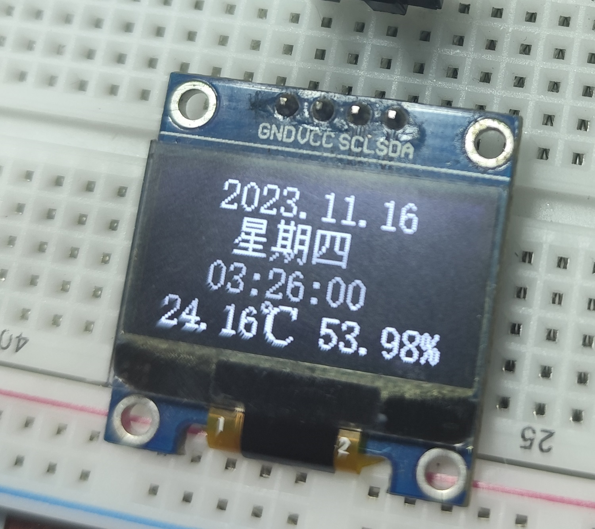
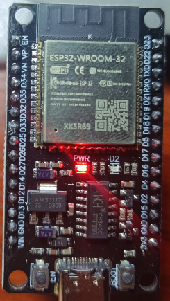
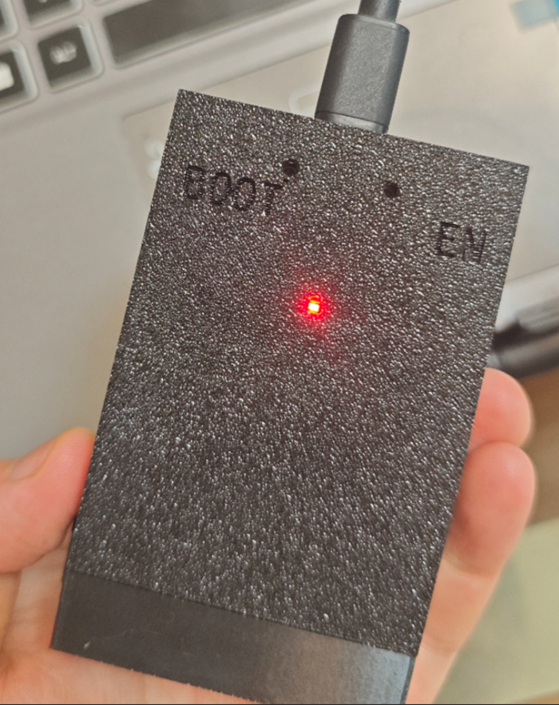
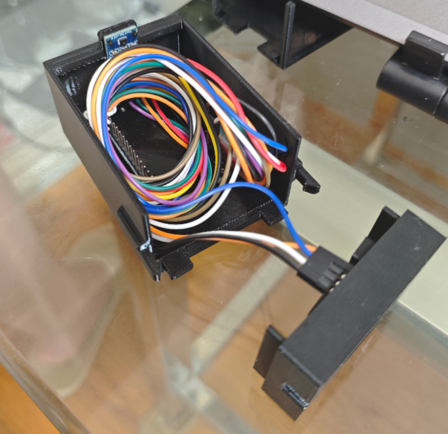

# tempo

2023/11/16  
一个支持联网对时，显示时间和温湿度的小玩意。刚学 ESP32，探索性做的，目前还不知道有什么问题，连续运行测试中。

  
  
基本逻辑就是通电后，连接设定好的 WiFi，然后同步时间，同步完成后关闭 WiFi，之后就是循环每秒刷新一次 OLED 显示内容，最下面一行是温度和湿度。另外对于周期性时间同步，只是简单实现，每天到 00:00:00 就重启 ESP32，然后就会从头走一遍。

2025/6/29  
最近我买了台 3D 打印机，自己画了一个[外壳](./resources/温湿度计外壳.STEP)。
  
  

2026/7/18  
将项目从 Arduino 平台迁移到 PlatformIO，有时间准备完善支持 WiFi 连接信息修改。

# 环境

## 硬件

ESP32-WROOM-32  
128x64 IIC OLED  
SHT30 温湿度计  

## 软件

* VScode
* PlatformIO IDE 3.3.4
* PlatformIO Core 6.1.19

## 引脚接线

SHT30 和 OLED 都是使用 IIC 通信，两者的 SDA 和 SCL 可以各自接到一起，然后插到 ESP32 引脚上。  
* SDA - 21
* SCL - 22  

# 许可证

本项目采用 [MIT 许可证](./LICENSE) 进行许可。